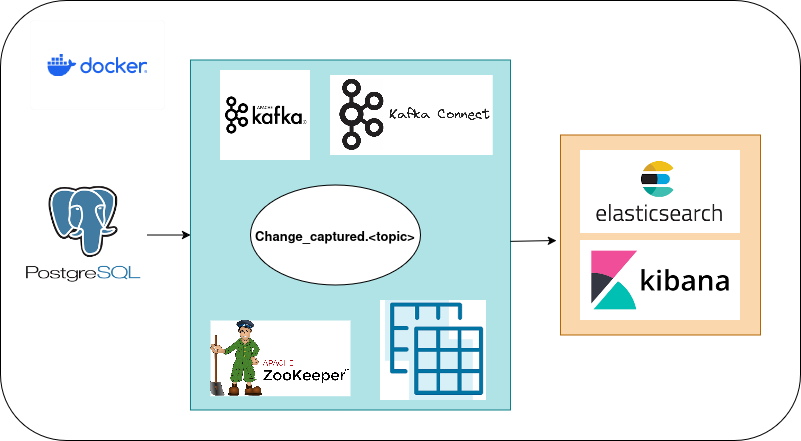

# CDCPipeline
A pipeline to capture database changes and store it in Elasticsearch.

## Table of Contents
### <ul> <li> [Architecture Diagram](#architecture-diagram) </ul>
### <ul> <li> [How it Works?](#how-it-works) </ul>
### <ul> <li> [Prerequisites](#prerequisites) </ul>
### <ul> <li> [Running Project](#running-project) </ul>
### <ul> <li> [Contact](#contact) </ul>

### Architecture Diagram


### How it Works
Make sure to read the **readme.txt** file first, as it contains all the information regarding connectors and ports.

This programme seeks to capture all the incremental changes from a relational database(Postgresql) and store it in **Elasticsearch**. **Kafka** cluster has been deployed using docker compose which captures the changes using **Kafka-Connect** and stores it in a topic named **Change_captured.<your-topic>**. From there, these changes are then carted to Elasticsearch which again has been hosted using docker and provides persistent storage for our data. The data can be retrieved using **curl** commands on the Elasticsearch cluster, but there is a better way, the GUI way which is made possible by **Kibana**, a free visualisation software that complements Elasticsearch. 

### Prerequisites
Software required to run the project. Install:
- [Docker](https://docs.docker.com/get-docker/) - You must allocate a minimum of 8 GB of Docker memory resource.
- [Python 3.10+ (pip)](https://www.python.org/)
- [docker-compose](https://docs.docker.com/compose/install/)

### Running Project
Shell scripts are wrappers for `docker-compose` which works as a managing tool in this project.

- Build project infrastructure
```
./start.sh
```

- Stop project infrastructure
```
./stop.sh
```

### Contact
Feel free to reach out to me regarding this project. Thanks!!!  <ins>Aayushh Dutta</ins>
